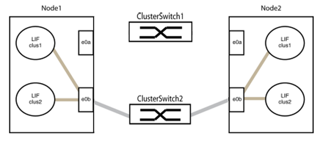

= 使用无交换机连接替换Cisco Nexus 3132Q-V 集群交换机
:allow-uri-read: 
:icons: font
:imagesdir: ../media/

[role="lead"]
在ONTAP 9.3 及更高版本中，您可以将集群从具有交换集群网络的集群迁移到两个节点直接连接的集群。

[NOTE]
====
NetApp建议您在对Cisco Nexus 3132Q-V 交换机进行从交换式集群到无交换式集群操作之前，更新您的ONTAP版本。

请参阅以下内容以了解更多详细信息：

* link:https://kb.netapp.com/Support_Bulletins/Customer_Bulletins/SU540["SU540：从 40G 网络交换机升级到 100G 网络交换机时，Chelsio T6 网卡错误导致系统关机"^]
* link:https://kb.netapp.com/on-prem/ontap/OHW/OHW-KBs/Node_panic_after_migration_from_switched_to_switchless_cluster["从有交换机集群迁移到无交换机集群后发生节点崩溃"^]

====
对于ONTAP 9.3 及更高版本，您可以将集群从具有交换集群网络的集群迁移到两个节点直接连接的集群。

== 审查要求

.实施准则
请查阅以下准则：

* 迁移到双节点无交换机集群配置是一个非中断性操作。大多数系统在每个节点上都有两个专用集群互连端口，但对于每个节点上具有更多专用集群互连端口（例如四个、六个或八个）的系统，您也可以使用此过程。
* 无交换机集群互连功能不能用于两个以上的节点。
* 如果您有一个使用集群互连交换机的现有双节点集群，并且运行的是ONTAP 9.3 或更高版本，则可以将交换机替换为节点之间的直接、背靠背连接。

.开始之前
请确保您拥有以下物品：

* 一个健康的集群，由两个节点通过集群交换机连接而成。节点必须运行相同的ONTAP版本。
* 每个节点都具有所需数量的专用集群端口，这些端口提供冗余的集群互连连接，以支持您的系统配置。例如，对于每个节点上有两个专用集群互连端口的系统，有两个冗余端口。

== 迁移交换机

.关于此任务
以下步骤将移除双节点集群中的集群交换机，并将每个与交换机的连接替换为与伙伴节点的直接连接。

image::../media/tnsc_clusterswitches_and_direct_connections.PNG[集群交换机被直接连接取代]

.关于示例
以下过程中的示例显示了使用“e0a”和“e0b”作为集群端口的节点。您的节点可能使用不同的集群端口，因为不同系统的集群端口可能不同。

=== 步骤 1：准备迁移

. 将权限级别更改为高级，输入 `y`当系统提示继续时：
+
`set -privilege advanced`

+
高级提示 `*>`出现。

. ONTAP 9.3 及更高版本支持自动检测无交换机集群，该功能默认启用。
+
您可以通过运行高级权限命令来验证是否已启用无交换机集群检测：

+
`network options detect-switchless-cluster show`

+
.显示示例
[%collapsible]
====
以下示例输出显示该选项是否已启用。

[listing]
----
cluster::*> network options detect-switchless-cluster show
   (network options detect-switchless-cluster show)
Enable Switchless Cluster Detection: true
----
====
+
如果“启用无交换机集群检测” `false`请联系NetApp支持。

. 如果此集群上启用了AutoSupport ，则通过调用AutoSupport消息来抑制自动创建案例：
+
`system node autosupport invoke -node * -type all -message MAINT=<number_of_hours>h`

+
在哪里 `h`是维护窗口的持续时间，以小时为单位。该消息通知技术支持人员此维护任务，以便他们在维护窗口期间禁止自动创建案例。

+
在以下示例中，该命令会抑制自动创建案例两小时：

+
.显示示例
[%collapsible]
====
[listing]
----
cluster::*> system node autosupport invoke -node * -type all -message MAINT=2h
----
====

=== 步骤二：配置端口和线缆

. 将每台交换机上的集群端口分成几组，使第 1 组的集群端口连接到集群交换机 1，第 2 组的集群端口连接到集群交换机 2。这些组在后续手术过程中是需要的。
. 识别集群端口并验证链路状态和运行状况：
+
`network port show -ipspace Cluster`

+
在以下示例中，对于集群端口为“e0a”和“e0b”的节点，一组被标识为“node1:e0a”和“node2:e0a”，另一组被标识为“node1:e0b”和“node2:e0b”。您的节点可能正在使用不同的集群端口，因为不同系统的集群端口可能不同。

+
image::../media/tnsc_clusterswitch_connections.PNG[集群交换机连接节点1和节点2]

+
确认端口的值是否为 `up`对于“链接”列，其值为 `healthy`在“健康状况”一栏中。

+
.显示示例
[%collapsible]
====
[listing]
----
cluster::> network port show -ipspace Cluster
Node: node1
                                                                 Ignore
                                             Speed(Mbps) Health  Health
Port  IPspace   Broadcast Domain Link  MTU   Admin/Oper	 Status  Status
----- --------- ---------------- ----- ----- ----------- ------- -------
e0a   Cluster   Cluster          up    9000  auto/10000  healthy false
e0b   Cluster   Cluster          up    9000  auto/10000  healthy false

Node: node2
                                                                 Ignore
                                             Speed(Mbps) Health  Health
Port  IPspace   Broadcast Domain Link  MTU   Admin/Oper	 Status  Status
----- --------- ---------------- ----- ----- ----------- ------- -------
e0a   Cluster   Cluster          up    9000  auto/10000  healthy false
e0b   Cluster   Cluster          up    9000  auto/10000  healthy false
4 entries were displayed.
----
====
. 确认集群中的所有 LIF 都位于其主端口上。
+
确认“is-home”列是否为空 `true`对于每个集群 LIF：

+
`network interface show -vserver Cluster -fields is-home`

+
.显示示例
[%collapsible]
====
[listing]
----
cluster::*> net int show -vserver Cluster -fields is-home
(network interface show)
vserver  lif          is-home
-------- ------------ --------
Cluster  node1_clus1  true
Cluster  node1_clus2  true
Cluster  node2_clus1  true
Cluster  node2_clus2  true
4 entries were displayed.
----
====
+
如果集群中存在未部署在其原端口上的 LIF，请将这些 LIF 恢复到其原端口：

+
`network interface revert -vserver Cluster -lif *`

. 禁用集群 LIF 的自动回滚功能：
+
`network interface modify -vserver Cluster -lif * -auto-revert false`

. 确认上一步中列出的所有端口都已连接到网络交换机：
+
`network device-discovery show -port _cluster_port_`

+
“已发现设备”列应显示端口所连接的集群交换机的名称。

+
.显示示例
[%collapsible]
====
以下示例表明集群端口“e0a”和“e0b”已正确连接到集群交换机“cs1”和“cs2”。

[listing]
----
cluster::> network device-discovery show -port e0a|e0b
  (network device-discovery show)
Node/     Local  Discovered
Protocol  Port   Device (LLDP: ChassisID)  Interface  Platform
--------- ------ ------------------------- ---------- ----------
node1/cdp
          e0a    cs1                       0/11       BES-53248
          e0b    cs2                       0/12       BES-53248
node2/cdp
          e0a    cs1                       0/9        BES-53248
          e0b    cs2                       0/9        BES-53248
4 entries were displayed.
----
====
. 验证远程集群接口的连接性：

[role="tabbed-block"]
====
.ONTAP 9.9.1 及更高版本
--
你可以使用 `network interface check cluster-connectivity`执行命令以启动集群连接性检查，然后显示详细信息：

`network interface check cluster-connectivity start`和 `network interface check cluster-connectivity show`

[listing, subs="+quotes"]
----
cluster1::*> *network interface check cluster-connectivity start*
----
*注意：*运行程序前请等待几秒钟 `show`显示详细信息的命令。

[listing, subs="+quotes"]
----
cluster1::*> *network interface check cluster-connectivity show*
                                  Source           Destination      Packet
Node   Date                       LIF              LIF              Loss
------ -------------------------- ---------------- ---------------- -----------
node1
       3/5/2022 19:21:18 -06:00   node1_clus2      node2-clus1      none
       3/5/2022 19:21:20 -06:00   node1_clus2      node2_clus2      none
node2
       3/5/2022 19:21:18 -06:00   node2_clus2      node1_clus1      none
       3/5/2022 19:21:20 -06:00   node2_clus2      node1_clus2      none
----
--
.所有ONTAP版本
--
对于所有ONTAP版本，您也可以使用 `cluster ping-cluster -node <name>`检查连接性的命令：

`cluster ping-cluster -node <name>`

[listing, subs="+quotes"]
----
cluster1::*> *cluster ping-cluster -node local*
Host is node2
Getting addresses from network interface table...
Cluster node1_clus1 169.254.209.69 node1 e0a
Cluster node1_clus2 169.254.49.125 node1 e0b
Cluster node2_clus1 169.254.47.194 node2 e0a
Cluster node2_clus2 169.254.19.183 node2 e0b
Local = 169.254.47.194 169.254.19.183
Remote = 169.254.209.69 169.254.49.125
Cluster Vserver Id = 4294967293
Ping status:

Basic connectivity succeeds on 4 path(s)
Basic connectivity fails on 0 path(s)

Detected 9000 byte MTU on 4 path(s):
Local 169.254.47.194 to Remote 169.254.209.69
Local 169.254.47.194 to Remote 169.254.49.125
Local 169.254.19.183 to Remote 169.254.209.69
Local 169.254.19.183 to Remote 169.254.49.125
Larger than PMTU communication succeeds on 4 path(s)
RPC status:
2 paths up, 0 paths down (tcp check)
2 paths up, 0 paths down (udp check)
----
--
====
. [[步骤7]] 验证集群是否运行正常：
+
`cluster ring show`

+
所有单元必须要么是主单元，要么是从单元。

. 为第 1 组端口设置无交换机配置。
+

IMPORTANT: 为避免潜在的网络问题，您必须断开 group1 中的端口，并尽快将它们重新连接起来，例如，*在 20 秒内*。

+
.. 同时断开第 1 组端口上的所有电缆。
+
在以下示例中，电缆从每个节点的端口“e0a”断开，集群流量继续通过交换机和每个节点的端口“e0b”传输：

+

.. 将第 1 组中的端口背靠背连接起来。
+
在以下示例中，节点 1 上的“e0a”连接到节点 2 上的“e0a”：

+
image::../media/tnsc_ports_e0a_direct_connection.PNG[端口“e0a”之间的直接连接]

. 无交换机集群网络选项从 `false`到 `true`。这可能需要长达 45 秒。确认无开关选项已设置为 `true`：
+
`network options switchless-cluster show`

+
以下示例表明已启用无交换机集群：

+
[listing]
----
cluster::*> network options switchless-cluster show
Enable Switchless Cluster: true
----
. 验证远程集群接口的连接性：

[role="tabbed-block"]
====
.ONTAP 9.9.1 及更高版本
--
你可以使用 `network interface check cluster-connectivity`执行命令以启动集群连接性检查，然后显示详细信息：

`network interface check cluster-connectivity start`和 `network interface check cluster-connectivity show`

[listing, subs="+quotes"]
----
cluster1::*> *network interface check cluster-connectivity start*
----
*注意：*运行程序前请等待几秒钟 `show`显示详细信息的命令。

[listing, subs="+quotes"]
----
cluster1::*> *network interface check cluster-connectivity show*
                                  Source           Destination      Packet
Node   Date                       LIF              LIF              Loss
------ -------------------------- ---------------- ---------------- -----------
node1
       3/5/2022 19:21:18 -06:00   node1_clus2      node2-clus1      none
       3/5/2022 19:21:20 -06:00   node1_clus2      node2_clus2      none
node2
       3/5/2022 19:21:18 -06:00   node2_clus2      node1_clus1      none
       3/5/2022 19:21:20 -06:00   node2_clus2      node1_clus2      none
----
--
.所有ONTAP版本
--
对于所有ONTAP版本，您也可以使用 `cluster ping-cluster -node <name>`检查连接性的命令：

`cluster ping-cluster -node <name>`

[listing, subs="+quotes"]
----
cluster1::*> *cluster ping-cluster -node local*
Host is node2
Getting addresses from network interface table...
Cluster node1_clus1 169.254.209.69 node1 e0a
Cluster node1_clus2 169.254.49.125 node1 e0b
Cluster node2_clus1 169.254.47.194 node2 e0a
Cluster node2_clus2 169.254.19.183 node2 e0b
Local = 169.254.47.194 169.254.19.183
Remote = 169.254.209.69 169.254.49.125
Cluster Vserver Id = 4294967293
Ping status:

Basic connectivity succeeds on 4 path(s)
Basic connectivity fails on 0 path(s)

Detected 9000 byte MTU on 4 path(s):
Local 169.254.47.194 to Remote 169.254.209.69
Local 169.254.47.194 to Remote 169.254.49.125
Local 169.254.19.183 to Remote 169.254.209.69
Local 169.254.19.183 to Remote 169.254.49.125
Larger than PMTU communication succeeds on 4 path(s)
RPC status:
2 paths up, 0 paths down (tcp check)
2 paths up, 0 paths down (udp check)
----
--
====

IMPORTANT: 在进行下一步之前，您必须至少等待两分钟，以确认第 1 组上的连续连接是否正常工作。

. [[step11]] 为第 2 组端口设置无交换机配置。
+

IMPORTANT: 为避免潜在的网络问题，您必须断开 group2 中的端口，并尽快将它们重新连接起来，例如，*在 20 秒内*。

+
.. 同时断开第 2 组端口上的所有电缆。
+
在以下示例中，每个节点上的端口“e0b”的电缆已断开，集群流量继续通过“e0a”端口之间的直接连接进行传输：

+
image::../media/tnsc_clusterswitch2_disconnected.PNG[集群交换机2已断开连接]

.. 将第 2 组中的端口背靠背连接起来。
+
在以下示例中，节点 1 上的“e0a”连接到节点 2 上的“e0a”，节点 1 上的“e0b”连接到节点 2 上的“e0b”：

+
image::../media/tnsc_node1_and_node2_direct_connection.PNG[节点1和节点2上的端口之间直接连接]

=== 步骤 3：验证配置

. 请确认两个节点上的端口连接正确：
+
`network device-discovery show -port _cluster_port_`

+
.显示示例
[%collapsible]
====
以下示例表明集群端口“e0a”和“e0b”已正确连接到集群伙伴上的相应端口：

[listing]
----
cluster::> net device-discovery show -port e0a|e0b
  (network device-discovery show)
Node/      Local  Discovered
Protocol   Port   Device (LLDP: ChassisID)  Interface  Platform
---------- ------ ------------------------- ---------- ----------
node1/cdp
           e0a    node2                     e0a        AFF-A300
           e0b    node2                     e0b        AFF-A300
node1/lldp
           e0a    node2 (00:a0:98:da:16:44) e0a        -
           e0b    node2 (00:a0:98:da:16:44) e0b        -
node2/cdp
           e0a    node1                     e0a        AFF-A300
           e0b    node1                     e0b        AFF-A300
node2/lldp
           e0a    node1 (00:a0:98:da:87:49) e0a        -
           e0b    node1 (00:a0:98:da:87:49) e0b        -
8 entries were displayed.
----
====
. 重新启用集群 LIF 的自动回滚功能：
+
`network interface modify -vserver Cluster -lif * -auto-revert true`

. 确认所有 LIF 设备都已到位。这可能需要几秒钟。
+
`network interface show -vserver Cluster -lif _lif_name_`

+
.显示示例
[%collapsible]
====
如果“是否在家”列为真，则 LIF 已被还原。 `true`如图所示 `node1_clus2`和 `node2_clus2`在以下示例中：

[listing]
----
cluster::> network interface show -vserver Cluster -fields curr-port,is-home
vserver  lif           curr-port is-home
-------- ------------- --------- -------
Cluster  node1_clus1   e0a       true
Cluster  node1_clus2   e0b       true
Cluster  node2_clus1   e0a       true
Cluster  node2_clus2   e0b       true
4 entries were displayed.
----
====
+
如果任何集群 LIFS 尚未恢复到其主端口，请从本地节点手动将其恢复：

+
`network interface revert -vserver Cluster -lif _lif_name_`

. 从任一节点的系统控制台检查节点的集群状态：
+
`cluster show`

+
.显示示例
[%collapsible]
====
以下示例显示两个节点上的 ε 均为 `false`：

[listing]
----
Node  Health  Eligibility Epsilon
----- ------- ----------- --------
node1 true    true        false
node2 true    true        false
2 entries were displayed.
----
====
. 验证远程集群接口的连接性：

[role="tabbed-block"]
====
.ONTAP 9.9.1 及更高版本
--
你可以使用 `network interface check cluster-connectivity`执行命令以启动集群连接性检查，然后显示详细信息：

`network interface check cluster-connectivity start`和 `network interface check cluster-connectivity show`

[listing, subs="+quotes"]
----
cluster1::*> *network interface check cluster-connectivity start*
----
*注意：*运行程序前请等待几秒钟 `show`显示详细信息的命令。

[listing, subs="+quotes"]
----
cluster1::*> *network interface check cluster-connectivity show*
                                  Source           Destination      Packet
Node   Date                       LIF              LIF              Loss
------ -------------------------- ---------------- ---------------- -----------
node1
       3/5/2022 19:21:18 -06:00   node1_clus2      node2-clus1      none
       3/5/2022 19:21:20 -06:00   node1_clus2      node2_clus2      none
node2
       3/5/2022 19:21:18 -06:00   node2_clus2      node1_clus1      none
       3/5/2022 19:21:20 -06:00   node2_clus2      node1_clus2      none
----
--
.所有ONTAP版本
--
对于所有ONTAP版本，您也可以使用 `cluster ping-cluster -node <name>`检查连接性的命令：

`cluster ping-cluster -node <name>`

[listing, subs="+quotes"]
----
cluster1::*> *cluster ping-cluster -node local*
Host is node2
Getting addresses from network interface table...
Cluster node1_clus1 169.254.209.69 node1 e0a
Cluster node1_clus2 169.254.49.125 node1 e0b
Cluster node2_clus1 169.254.47.194 node2 e0a
Cluster node2_clus2 169.254.19.183 node2 e0b
Local = 169.254.47.194 169.254.19.183
Remote = 169.254.209.69 169.254.49.125
Cluster Vserver Id = 4294967293
Ping status:

Basic connectivity succeeds on 4 path(s)
Basic connectivity fails on 0 path(s)

Detected 9000 byte MTU on 4 path(s):
Local 169.254.47.194 to Remote 169.254.209.69
Local 169.254.47.194 to Remote 169.254.49.125
Local 169.254.19.183 to Remote 169.254.209.69
Local 169.254.19.183 to Remote 169.254.49.125
Larger than PMTU communication succeeds on 4 path(s)
RPC status:
2 paths up, 0 paths down (tcp check)
2 paths up, 0 paths down (udp check)
----
--
====
. [[步骤6]] 如果您已禁用自动创建案例功能，请通过调用AutoSupport消息重新启用该功能：
+
`system node autosupport invoke -node * -type all -message MAINT=END`

+
有关详细信息，请参阅 link:https://kb.netapp.com/Advice_and_Troubleshooting/Data_Storage_Software/ONTAP_OS/How_to_suppress_automatic_case_creation_during_scheduled_maintenance_windows_-_ONTAP_9["NetApp 知识库文章 1010449：如何在计划的维护时间段禁止自动创建案例"^]。

. 将权限级别改回管理员：
+
`set -privilege admin`

