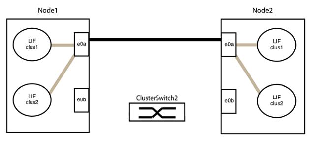

= 将Cisco Nexus 3132Q-V集群交换机更换为无交换机连接
:allow-uri-read: 
:icons: font
:imagesdir: ../media/

[role="lead"]
对于ONTAP 9.3及更高版本、您可以从具有交换集群网络的集群迁移到两个节点直接连接的集群。

== 查看要求

.准则
请查看以下准则：

* 迁移到双节点无交换机集群配置是一项无中断操作。大多数系统在每个节点上都有两个专用集群互连端口、但对于每个节点上具有更多专用集群互连端口的系统、例如四个、六个或八个、您也可以使用此操作步骤。
* 不能对两个以上的节点使用无交换机集群互连功能。
* 如果您的现有双节点集群使用集群互连交换机、并且运行的是ONTAP 9.3或更高版本、则可以将这些交换机替换为节点之间的直接背对背连接。

.您需要的内容
* 一个运行正常的集群、由两个节点组成、这些节点由集群交换机连接。节点必须运行相同的ONTAP 版本。
* 每个节点都具有所需数量的专用集群端口、这些端口可提供冗余集群互连连接以支持您的系统配置。例如、对于每个节点上具有两个专用集群互连端口的系统、有两个冗余端口。

== 迁移交换机

.关于此任务
以下操作步骤 将删除双节点集群中的集群交换机、并将与交换机的每个连接替换为直接连接到配对节点。

image::../media/tnsc_clusterswitches_and_direct_connections.PNG[集群交换机已替换为直接连接]

.关于示例
以下操作步骤 中的示例显示了使用"e0a"和"e0b"作为集群端口的节点。您的节点可能使用不同的集群端口、因为它们因系统而异。

=== 第1步：准备迁移

. 将权限级别更改为高级，在系统提示您继续时输入 `y` ：
+
`set -privilege advanced`

+
此时将显示高级提示符`*>`。

. ONTAP 9.3及更高版本支持自动检测无交换机集群、默认情况下处于启用状态。
+
您可以通过运行高级权限命令来验证是否已启用无交换机集群检测：

+
`network options detect-switchless-cluster show`

+
.显示示例
[%collapsible]
====
以下示例输出显示了是否已启用此选项。

[listing]
----
cluster::*> network options detect-switchless-cluster show
   (network options detect-switchless-cluster show)
Enable Switchless Cluster Detection: true
----
====
+
如果"启用无交换机集群检测"为 `false`、请联系NetApp支持部门。

. 如果在此集群上启用了 AutoSupport ，则通过调用 AutoSupport 消息禁止自动创建案例：
+
`s系统节点AutoSupport 调用-node *-type all -message MAINT=<number_of_hours>h`

+
其中`h`是维护时段的持续时间、以小时为单位。此消息会通知技术支持此维护任务、以便他们可以禁止在维护窗口期间自动创建案例。

+
在以下示例中、命令会禁止自动创建案例两小时：

+
.显示示例
[%collapsible]
====
[listing]
----
cluster::*> system node autosupport invoke -node * -type all -message MAINT=2h
----
====

=== 第2步：配置端口和布线

. 将每个交换机上的集群端口组织成组、以便组1中的集群端口转到集群交换机1、而组2中的集群端口转到集群交换机2。这些组稍后在操作步骤 中是必需的。
. 确定集群端口并验证链路状态和运行状况：
+
`network port show -ipspace cluster`

+
在以下示例中、对于集群端口为"e0a"和"e0b"的节点、一个组标识为"node1：e0a"和"node2：e0a"、另一个组标识为"node1：e0b"和"node2：e0b"。您的节点可能使用不同的集群端口、因为它们因系统而异。

+
image::../media/tnsc_clusterswitch_connections.PNG[node1和node2之间的集群交换机连接]

+
验证端口的值是否为 `up` 用于"Link"列和的值 `healthy` 运行状况列。

+
.显示示例
[%collapsible]
====
[listing]
----
cluster::> network port show -ipspace Cluster
Node: node1
                                                                 Ignore
                                             Speed(Mbps) Health  Health
Port  IPspace   Broadcast Domain Link  MTU   Admin/Oper	 Status  Status
----- --------- ---------------- ----- ----- ----------- ------- -------
e0a   Cluster   Cluster          up    9000  auto/10000  healthy false
e0b   Cluster   Cluster          up    9000  auto/10000  healthy false

Node: node2
                                                                 Ignore
                                             Speed(Mbps) Health  Health
Port  IPspace   Broadcast Domain Link  MTU   Admin/Oper	 Status  Status
----- --------- ---------------- ----- ----- ----------- ------- -------
e0a   Cluster   Cluster          up    9000  auto/10000  healthy false
e0b   Cluster   Cluster          up    9000  auto/10000  healthy false
4 entries were displayed.
----
====
. 确认所有集群LIF均位于其主端口上。
+
验证每个集群LIF的"is-home"列是否为`true`：

+
`network interface show -vserver cluster -fields is-home`

+
.显示示例
[%collapsible]
====
[listing]
----
cluster::*> net int show -vserver Cluster -fields is-home
(network interface show)
vserver  lif          is-home
-------- ------------ --------
Cluster  node1_clus1  true
Cluster  node1_clus2  true
Cluster  node2_clus1  true
Cluster  node2_clus2  true
4 entries were displayed.
----
====
+
如果集群LIF不在其主端口上、请将这些LIF还原到其主端口：

+
`network interface revert -vserver cluster -lif *`

. 为集群LIF禁用自动还原：
+
`network interface modify -vserver cluster -lif *-auto-revert false`

. 验证上一步中列出的所有端口是否均已连接到网络交换机：
+
`network device-discovery show -port _cluster_port_`

+
"Discovered Device"列应是端口所连接的集群交换机的名称。

+
.显示示例
[%collapsible]
====
以下示例显示集群端口"e0a"和"e0b"已正确连接到集群交换机"CS1"和"CS2"。

[listing]
----
cluster::> network device-discovery show -port e0a|e0b
  (network device-discovery show)
Node/     Local  Discovered
Protocol  Port   Device (LLDP: ChassisID)  Interface  Platform
--------- ------ ------------------------- ---------- ----------
node1/cdp
          e0a    cs1                       0/11       BES-53248
          e0b    cs2                       0/12       BES-53248
node2/cdp
          e0a    cs1                       0/9        BES-53248
          e0b    cs2                       0/9        BES-53248
4 entries were displayed.
----
====
. 验证集群连接：
+
`cluster ping-cluster -node local`

. 验证集群是否运行正常：
+
`集群环显示`

+
所有单元都必须为主单元或二级单元。

. 为组1中的端口设置无交换机配置。
+

IMPORTANT: 为了避免潜在的网络连接问题、您必须断开端口与组1的连接、并尽快地将其重新连接起来、例如、*不到20秒*。

+
.. 同时断开与组1中端口的所有缆线。
+
在以下示例中、缆线与每个节点上的端口"e0a"断开连接、集群流量继续通过交换机和每个节点上的端口"e0b"进行传输：

+
image::../media/tnsc_clusterswitch1_disconnected.PNG[ClusterSwitch1已断开连接]

.. 使用缆线将组1中的端口背靠背连接在一起。
+
在以下示例中、node1上的"e0a"连接到node2上的"e0a"：

+
image::../media/tnsc_ports_e0a_direct_connection.PNG[端口"e0a"之间的直接连接]

. 无交换机集群网络选项从`false`过渡到`true`。这可能需要长达45秒。确认无交换机选项设置为`true`：
+
`network options switchless-cluster show`

+
以下示例显示无交换机集群已启用：

+
[listing]
----
cluster::*> network options switchless-cluster show
Enable Switchless Cluster: true
----
. 验证集群网络是否未中断：
+
`cluster ping-cluster -node local`

+

IMPORTANT: 在继续执行下一步之前、您必须至少等待两分钟、以确认组1上的背对背连接正常工作。

. 为组2中的端口设置无交换机配置。
+

IMPORTANT: 为了避免潜在的网络连接问题、您必须断开端口与组2的连接、并尽快地将其重新连接起来、例如、*不到20秒*。

+
.. 同时断开与组2中端口的所有缆线。
+
在以下示例中、缆线与每个节点上的端口"e0b"断开连接、集群流量继续通过"e0a"端口之间的直接连接进行：

+

.. 使用缆线将group2中的端口背靠背连接在一起。
+
在以下示例中、node1上的"e0a"连接到node2上的"e0a"、node1上的"e0b"连接到node2上的"e0b"：

+
image::../media/tnsc_node1_and_node2_direct_connection.PNG[在node1和node2上的端口之间直接连接]

=== 第3步：验证配置

. 验证两个节点上的端口是否已正确连接：
+
`network device-discovery show -port _cluster_port_`

+
.显示示例
[%collapsible]
====
以下示例显示集群端口"e0a"和"e0b"已正确连接到集群配对节点上的相应端口：

[listing]
----
cluster::> net device-discovery show -port e0a|e0b
  (network device-discovery show)
Node/      Local  Discovered
Protocol   Port   Device (LLDP: ChassisID)  Interface  Platform
---------- ------ ------------------------- ---------- ----------
node1/cdp
           e0a    node2                     e0a        AFF-A300
           e0b    node2                     e0b        AFF-A300
node1/lldp
           e0a    node2 (00:a0:98:da:16:44) e0a        -
           e0b    node2 (00:a0:98:da:16:44) e0b        -
node2/cdp
           e0a    node1                     e0a        AFF-A300
           e0b    node1                     e0b        AFF-A300
node2/lldp
           e0a    node1 (00:a0:98:da:87:49) e0a        -
           e0b    node1 (00:a0:98:da:87:49) e0b        -
8 entries were displayed.
----
====
. 为集群LIF重新启用自动还原：
+
`network interface modify -vserver cluster -lif *-auto-revert true`

. 验证所有LIF是否均已归位。这可能需要几秒钟的时间。
+
`network interface show -vserver cluster -lif _lif_name_`

+
.显示示例
[%collapsible]
====
如果"Is Home"列为`true`、则已还原LIF、如以下示例中的`node1_clus2`和`node2_clus2`所示：

[listing]
----
cluster::> network interface show -vserver Cluster -fields curr-port,is-home
vserver  lif           curr-port is-home
-------- ------------- --------- -------
Cluster  node1_clus1   e0a       true
Cluster  node1_clus2   e0b       true
Cluster  node2_clus1   e0a       true
Cluster  node2_clus2   e0b       true
4 entries were displayed.
----
====
+
如果任何集群LUN尚未返回其主端口、请从本地节点手动还原它们：

+
`network interface revert -vserver cluster -lif _lif_name_`

. 从任一节点的系统控制台检查节点的集群状态：
+
`cluster show`

+
.显示示例
[%collapsible]
====
以下示例显示了两个节点上的epsilon均为`false`：

[listing]
----
Node  Health  Eligibility Epsilon
----- ------- ----------- --------
node1 true    true        false
node2 true    true        false
2 entries were displayed.
----
====
. 确认集群端口之间的连接：
+
`cluster ping-cluster local`

. 如果禁止自动创建案例，请通过调用 AutoSupport 消息重新启用它：
+
`ssystem node AutoSupport invoke -node * -type all -message MAINT=end`

+
有关详细信息，请参见 link:https://kb.netapp.com/Advice_and_Troubleshooting/Data_Storage_Software/ONTAP_OS/How_to_suppress_automatic_case_creation_during_scheduled_maintenance_windows_-_ONTAP_9["NetApp 知识库文章 1010449 ： How to suppress automatic case creation during scheduled maintenance windows."^]。

. 将权限级别重新更改为 admin ：
+
`set -privilege admin`

