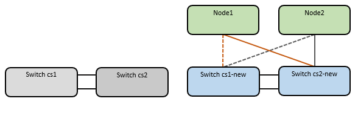

= 从旧版Cisco交换机迁移到Cisco Nexus 9336C-x2集群交换机
:allow-uri-read: 
:icons: font
:imagesdir: ../media/

[role="lead"]
您可以将ONTAP 集群的旧版Cisco集群交换机迁移到Cisco Nexus 9336C-x2存储网络交换机。这是一个无中断操作步骤。

== 查看要求

确保：

* Nexus 9336C -FX2交换机上的某些端口配置为以10GbE或40GbE速度运行。
* 已规划、迁移和记录从节点到Nexus 9336C -FX2集群交换机的10GbE和40GbE连接。
* 集群完全正常运行(日志中不应出现任何错误或类似问题)。
* Cisco Nexus 9336C-x2交换机的初始自定义已完成、以便：
+
** 9336C-FX2交换机正在运行建议的最新软件版本。
** 参考配置文件(Reference Configuration Files、RCF)已应用于交换机。
** 任何站点自定义、例如DNS、NTP、SMTP、SNMP、和SSH。

* 您可以访问上的交换机兼容性表 https://mysupport.netapp.com/site/info/cisco-ethernet-switch["Cisco 以太网交换机"^] 页面上显示了受支持的 ONTAP ， NX-OS 和 RCF 版本。
* 您已查看Cisco网站上有关Cisco交换机升级和降级过程的相应软件和升级指南、网址为 https://www.cisco.com/c/en/us/support/switches/nexus-9000-series-switches/series.html["Cisco Nexus 9000 系列交换机支持"^] 页面。

NOTE: 如果要更改AFF A800或AFF C800系统上e0a和e1a集群端口的端口速度、则可能会在速度转换后看到接收到格式错误的数据包。请参见  https://mysupport.netapp.com/site/bugs-online/product/ONTAP/BURT/1570339["错误1570339"^] 和知识库文章 https://kb.netapp.com/onprem/ontap/hardware/CRC_errors_on_T6_ports_after_converting_from_40GbE_to_100GbE["从40GbE转换到100GbE后、在调整端口配置为36的端口上出现CRC错误"^] 以获得指导。

== 迁移交换机

.关于示例
此操作步骤中的示例使用两个节点。这些节点使用两个 10GbE 集群互连端口 e0a 和 e0b 。请参见 https://hwu.netapp.com/["Hardware Universe"^] 验证平台上的集群端口是否正确。

NOTE: 根据不同版本的ONTAP 、命令输出可能会有所不同。

此操作步骤中的示例使用以下交换机和节点命名：

* 现有两个Cisco交换机的名称分别为*CS1*和*CS2*
* 新的Nexus 9336C-x2集群交换机为* CS1-new*和* CS2-new*。
* 节点名称为*节点1 *和*节点2 *。
* 节点1的集群LIF名称分别为*节点1_clus1*和*节点1_clus2*、节点2的集群LIF名称分别为*节点2_clus1*和*节点2_clus2*。
* cluster1：：：*)*提示符用于指示集群的名称。

在此操作步骤 期间、请参见以下示例：

image::../media/Initial_setup.png[初始交换机设置]

.关于此任务
操作步骤 需要同时使用ONTAP 命令和 https://www.cisco.com/c/en/us/support/switches/nexus-9000-series-switches/series.html["Nexus 9000系列交换机"^] 命令；除非另有说明、否则使用ONTAP 命令。

此操作步骤包括以下情形：

* 交换机CS2将首先替换为交换机CS2-new。
+
** 关闭集群节点的端口。必须同时关闭所有端口、以避免集群不稳定。
** 然后、从CS2断开节点和CS2之间的布线、并重新连接到CS2-new。

* 交换机CS1由交换机CS1-new取代。
+
** 关闭集群节点的端口。必须同时关闭所有端口、以避免集群不稳定。
** 然后、从CS1断开节点和CS1之间的布线、并重新连接到CS1-new。

NOTE: 在此操作步骤 期间、不需要可操作的交换机间链路(ISL)。这是设计上的原因、因为RCF版本更改可能会暂时影响ISL连接。为了确保集群无中断运行、以下操作步骤 会在对目标交换机执行步骤时将所有集群LIF迁移到运行中的配对交换机。

=== 第1步：准备迁移

. 如果在此集群上启用了 AutoSupport ，请通过调用 AutoSupport 消息来禁止自动创建案例： `ssystem node AutoSupport invoke -node * -type all -message MAINT=xh`
+
其中 _x_ 是维护时段的持续时间，以小时为单位。

+

NOTE: AutoSupport 消息会通知技术支持此维护任务，以便在维护窗口期间禁止自动创建案例。

. 将权限级别更改为高级，在系统提示您继续时输入 * y * ：
+
`set -privilege advanced`

+
此时将显示高级提示符（ * > ）。

=== 第2步：配置端口和布线

. 在新交换机上、确认交换机CS1-new和CS2-new之间的ISL已布线且运行状况良好：
+
`s如何执行端口通道摘要`

+
.显示示例
[%collapsible]
====
[listing, subs="+quotes"]
----
cs1-new# *show port-channel summary*
Flags:  D - Down        P - Up in port-channel (members)
        I - Individual  H - Hot-standby (LACP only)
        s - Suspended   r - Module-removed
        b - BFD Session Wait
        S - Switched    R - Routed
        U - Up (port-channel)
        p - Up in delay-lacp mode (member)
        M - Not in use. Min-links not met
--------------------------------------------------------------------------------
Group Port-       Type     Protocol  Member Ports
      Channel
--------------------------------------------------------------------------------
1     Po1(SU)     Eth      LACP      Eth1/35(P)   Eth1/36(P)

cs2-new# *show port-channel summary*
Flags:  D - Down        P - Up in port-channel (members)
        I - Individual  H - Hot-standby (LACP only)
        s - Suspended   r - Module-removed
        b - BFD Session Wait
        S - Switched    R - Routed
        U - Up (port-channel)
        p - Up in delay-lacp mode (member)
        M - Not in use. Min-links not met
--------------------------------------------------------------------------------
Group Port-       Type     Protocol  Member Ports
      Channel
--------------------------------------------------------------------------------
1     Po1(SU)     Eth      LACP      Eth1/35(P)   Eth1/36(P)
----
====
. 显示每个节点上连接到现有集群交换机的集群端口：
+
`network device-discovery show`

+
.显示示例
[%collapsible]
====
[listing, subs="+quotes"]
----
cluster1::*> *network device-discovery show -protocol cdp*
Node/       Local  Discovered
Protocol    Port   Device (LLDP: ChassisID)  Interface         Platform
----------- ------ ------------------------- ----------------  ----------------
node1      /cdp
            e0a    cs1                       Ethernet1/1        N5K-C5596UP
            e0b    cs2                       Ethernet1/2        N5K-C5596UP
node2      /cdp
            e0a    cs1                       Ethernet1/1        N5K-C5596UP
            e0b    cs2                       Ethernet1/2        N5K-C5596UP
----
====
. 确定每个集群端口的管理或运行状态。
+
.. 验证所有集群端口是否均已启动且状态正常：
+
`network port show -ipspace cluster`

+
.显示示例
[%collapsible]
====
[listing, subs="+quotes"]
----
cluster1::*> *network port show -ipspace Cluster*

Node: node1
                                                                       Ignore
                                                  Speed(Mbps) Health   Health
Port      IPspace      Broadcast Domain Link MTU  Admin/Oper  Status   Status
--------- ------------ ---------------- ---- ---- ----------- -------- ------
e0a       Cluster      Cluster          up   9000  auto/10000 healthy  false
e0b       Cluster      Cluster          up   9000  auto/10000 healthy  false

Node: node2
                                                                       Ignore
                                                  Speed(Mbps) Health   Health
Port      IPspace      Broadcast Domain Link MTU  Admin/Oper  Status   Status
--------- ------------ ---------------- ---- ---- ----------- -------- ------
e0a       Cluster      Cluster          up   9000  auto/10000 healthy  false
e0b       Cluster      Cluster          up   9000  auto/10000 healthy  false
----
====
.. 验证所有集群接口(LIF)是否位于其主端口上：
+
`network interface show -vserver cluster`

+
.显示示例
[%collapsible]
====
[listing, subs="+quotes"]
----
cluster1::*> *network interface show -vserver Cluster*

            Logical      Status     Network            Current     Current Is
Vserver     Interface    Admin/Oper Address/Mask       Node        Port    Home
----------- -----------  ---------- ------------------ ----------- ------- ----
Cluster
            node1_clus1  up/up      169.254.209.69/16  node1       e0a     true
            node1_clus2  up/up      169.254.49.125/16  node1       e0b     true
            node2_clus1  up/up      169.254.47.194/16  node2       e0a     true
            node2_clus2  up/up      169.254.19.183/16  node2       e0b     true
----
====
.. 验证集群是否同时显示两个集群交换机的信息：
+
`ssystem cluster-switch show -is-monitoring-enableed-Operational true`

+
.显示示例
[%collapsible]
====
[listing, subs="+quotes"]
----
cluster1::*> *system cluster-switch show -is-monitoring-enabled-operational true*
Switch                      Type               Address          Model
--------------------------- ------------------ ---------------- ---------------
cs1                         cluster-network    10.233.205.92    N5K-C5596UP
      Serial Number: FOXXXXXXXGS
       Is Monitored: true
             Reason: None
   Software Version: Cisco Nexus Operating System (NX-OS) Software, Version
                     9.3(4)
     Version Source: CDP

cs2                         cluster-network     10.233.205.93   N5K-C5596UP
      Serial Number: FOXXXXXXXGD
       Is Monitored: true
             Reason: None
   Software Version: Cisco Nexus Operating System (NX-OS) Software, Version
                     9.3(4)
     Version Source: CDP
----
====

. 在集群 LIF 上禁用自动还原。
+
`network interface modify -vserver cluster -lif *-auto-revert false`

+

NOTE: 禁用自动还原可确保ONTAP仅在交换机端口稍后关闭时对集群LUN进行故障转移。

. 在集群交换机CS2上、关闭连接到*所有*节点的集群端口的端口、以便对集群Lifs进行故障转移：
+
[listing, subs="+quotes"]
----
cs2(config)# *interface eth1/1-1/2*
cs2(config-if-range)# *shutdown*
----
. 验证集群SIFs是否已故障转移到集群交换机CS1上托管的端口。这可能需要几秒钟的时间。
+
`network interface show -vserver cluster`

+
.显示示例
[%collapsible]
====
[listing, subs="+quotes"]
----
cluster1::*> *network interface show -vserver Cluster*
            Logical       Status     Network            Current    Current Is
Vserver     Interface     Admin/Oper Address/Mask       Node       Port    Home
----------- ------------- ---------- ------------------ ---------- ------- ----
Cluster
            node1_clus1   up/up      169.254.3.4/16     node1      e0a     true
            node1_clus2   up/up      169.254.3.5/16     node1      e0a     false
            node2_clus1   up/up      169.254.3.8/16     node2      e0a     true
            node2_clus2   up/up      169.254.3.9/16     node2      e0a     false
----
====
. 验证集群是否运行正常：
+
`cluster show`

+
.显示示例
[%collapsible]
====
[listing, subs="+quotes"]
----
cluster1::*> cluster show
Node       Health  Eligibility   Epsilon
---------- ------- ------------- -------
node1      true    true          false
node2      true    true          false
----
====
. 将所有集群节点连接缆线从旧CS2交换机移至新的CS2交换机。
+
*集群节点连接电缆已移至CS2-new交换机*

+
image::../media/new_switch_cs1.png[已将集群节点连接缆线移至CS2新交换机]

. 确认已移至CS2-NEW的网络连接的运行状况：
+
`network port show -ipspace cluster`

+
.显示示例
[%collapsible]
====
[listing, subs="+quotes"]
----
cluster1::*> *network port show -ipspace Cluster*

Node: node1
                                                                       Ignore
                                                  Speed(Mbps) Health   Health
Port      IPspace      Broadcast Domain Link MTU  Admin/Oper  Status   Status
--------- ------------ ---------------- ---- ---- ----------- -------- ------
e0a       Cluster      Cluster          up   9000  auto/10000 healthy  false
e0b       Cluster      Cluster          up   9000  auto/10000 healthy  false

Node: node2
                                                                       Ignore
                                                  Speed(Mbps) Health   Health
Port      IPspace      Broadcast Domain Link MTU  Admin/Oper  Status   Status
--------- ------------ ---------------- ---- ---- ----------- -------- ------
e0a       Cluster      Cluster          up   9000  auto/10000 healthy  false
e0b       Cluster      Cluster          up   9000  auto/10000 healthy  false
----
====
+
移动的所有集群端口都应已启动。

. 检查集群端口上的邻居信息：
+
`network device-discovery show -protocol cdp`

+
.显示示例
[%collapsible]
====
[listing, subs="+quotes"]
----
cluster1::*> *network device-discovery show -protocol cdp*

Node/       Local  Discovered
Protocol    Port   Device (LLDP: ChassisID)  Interface      Platform
----------- ------ ------------------------- -------------  --------------
node1      /cdp
            e0a    cs1                       Ethernet1/1    N5K-C5596UP
            e0b    cs2-new                   Ethernet1/1/1  N9K-C9336C-FX2

node2      /cdp
            e0a    cs1                       Ethernet1/2    N5K-C5596UP
            e0b    cs2-new                   Ethernet1/1/2  N9K-C9336C-FX2
----
====
+
验证移动的集群端口是否将CS2-new交换机视为邻居。

. 从交换机CS2-NEW的角度确认交换机端口连接：
+
[listing, subs="+quotes"]
----
cs2-new# *show interface brief*
cs2-new# *show cdp neighbors*
----
. 在集群交换机CS1上、关闭连接到*所有*节点的集群端口的端口、以便对集群LI进行故障转移。
+
[listing, subs="+quotes"]
----
cs1(config)# *interface eth1/1-1/2*
cs1(config-if-range)# *shutdown*
----
+
所有集群的Sifs都会故障转移到CS2新交换机。

. 验证集群SIFs是否已故障转移到交换机CS2-NEW上托管的端口。这可能需要几秒钟的时间：
+
`network interface show -vserver cluster`

+
.显示示例
[%collapsible]
====
[listing, subs="+quotes"]
----
cluster1::*> *network interface show -vserver Cluster*
            Logical      Status     Network            Current     Current Is
Vserver     Interfac     Admin/Oper Address/Mask       Node        Port    Home
----------- ------------ ---------- ------------------ ----------- ------- ----
Cluster
            node1_clus1  up/up      169.254.3.4/16     node1       e0b     false
            node1_clus2  up/up      169.254.3.5/16     node1       e0b     true
            node2_clus1  up/up      169.254.3.8/16     node2       e0b     false
            node2_clus2  up/up      169.254.3.9/16     node2       e0b     true
----
====
. 验证集群是否运行正常：
+
`cluster show`

+
.显示示例
[%collapsible]
====
[listing, subs="+quotes"]
----
cluster1::*> *cluster show*
Node       Health  Eligibility   Epsilon
---------- ------- ------------- -------
node1      true    true          false
node2      true    true          false
----
====
. 将集群节点连接缆线从CS1移至新的CS1新交换机。
+
*集群节点连接电缆已移至CS1-new交换机*

+

. 确认已移至CS1-NEW的网络连接的运行状况：
+
`network port show -ipspace cluster`

+
.显示示例
[%collapsible]
====
[listing, subs="+quotes"]
----
cluster1::*> *network port show -ipspace Cluster*

Node: node1
                                                                       Ignore
                                                  Speed(Mbps) Health   Health
Port      IPspace      Broadcast Domain Link MTU  Admin/Oper  Status   Status
--------- ------------ ---------------- ---- ---- ----------- -------- ------
e0a       Cluster      Cluster          up   9000  auto/10000 healthy  false
e0b       Cluster      Cluster          up   9000  auto/10000 healthy  false

Node: node2
                                                                       Ignore
                                                  Speed(Mbps) Health   Health
Port      IPspace      Broadcast Domain Link MTU  Admin/Oper  Status   Status
--------- ------------ ---------------- ---- ---- ----------- -------- ------
e0a       Cluster      Cluster          up   9000  auto/10000 healthy  false
e0b       Cluster      Cluster          up   9000  auto/10000 healthy  false
----
====
+
移动的所有集群端口都应已启动。

. 检查集群端口上的邻居信息：
+
`network device-discovery show`

+
.显示示例
[%collapsible]
====
[listing, subs="+quotes"]
----
cluster1::*> *network device-discovery show -protocol cdp*
Node/       Local  Discovered
Protocol    Port   Device (LLDP: ChassisID)  Interface       Platform
----------- ------ ------------------------- --------------  --------------
node1      /cdp
            e0a    cs1-new                   Ethernet1/1/1   N9K-C9336C-FX2
            e0b    cs2-new                   Ethernet1/1/2   N9K-C9336C-FX2

node2      /cdp
            e0a    cs1-new                   Ethernet1/1/1   N9K-C9336C-FX2
            e0b    cs2-new                   Ethernet1/1/2   N9K-C9336C-FX2
----
====
+
验证移动的集群端口是否将CS1-new交换机视为邻居。

. 从交换机CS1-NEW的角度确认交换机端口连接：
+
[listing, subs="+quotes"]
----
cs1-new# *show interface brief*
cs1-new# *show cdp neighbors*
----
. 验证CS1-NEW和CS2-NEW之间的ISL是否仍正常运行：
+
`s如何执行端口通道摘要`

+
.显示示例
[%collapsible]
====
[listing, subs="+quotes"]
----
cs1-new# *show port-channel summary*
Flags:  D - Down        P - Up in port-channel (members)
        I - Individual  H - Hot-standby (LACP only)
        s - Suspended   r - Module-removed
        b - BFD Session Wait
        S - Switched    R - Routed
        U - Up (port-channel)
        p - Up in delay-lacp mode (member)
        M - Not in use. Min-links not met
--------------------------------------------------------------------------------
Group Port-       Type     Protocol  Member Ports
      Channel
--------------------------------------------------------------------------------
1     Po1(SU)     Eth      LACP      Eth1/35(P)   Eth1/36(P)

cs2-new# *show port-channel summary*
Flags:  D - Down        P - Up in port-channel (members)
        I - Individual  H - Hot-standby (LACP only)
        s - Suspended   r - Module-removed
        b - BFD Session Wait
        S - Switched    R - Routed
        U - Up (port-channel)
        p - Up in delay-lacp mode (member)
        M - Not in use. Min-links not met
--------------------------------------------------------------------------------
Group Port-       Type     Protocol  Member Ports
      Channel
--------------------------------------------------------------------------------
1     Po1(SU)     Eth      LACP      Eth1/35(P)   Eth1/36(P)
----
====

=== 第3步：验证配置

. 在集群 LIF 上启用自动还原。
+
`network interface modify -vserver cluster -lif *-auto-revert true`

. 验证集群LIF是否已还原到其主端口(这可能需要一分钟时间)：
+
`network interface show -vserver cluster`

+
如果集群LIF尚未还原到其主端口、请手动还原它们：

+
`network interface revert -vserver cluster -lif *`

. 验证集群是否运行正常：
+
`cluster show`

. 验证远程集群接口的连接：

[role="tabbed-block"]
====
.ONTAP 9.9.1及更高版本
--
您可以使用 `network interface check cluster-connectivity` 命令启动集群连接的可访问性检查、然后显示详细信息：

`network interface check cluster-connectivity start` 和 `network interface check cluster-connectivity show`

[listing, subs="+quotes"]
----
cluster1::*> *network interface check cluster-connectivity start*
----
*注：*请等待几秒钟、然后再运行show命令显示详细信息。

[listing, subs="+quotes"]
----
cluster1::*> *network interface check cluster-connectivity show*
                                  Source          Destination       Packet
Node   Date                       LIF             LIF               Loss
------ -------------------------- --------------- ----------------- -----------
node1
       3/5/2022 19:21:18 -06:00   node1_clus2      node2_clus1      none
       3/5/2022 19:21:20 -06:00   node1_clus2      node2_clus2      none

node2
       3/5/2022 19:21:18 -06:00   node2_clus2      node1_clus1      none
       3/5/2022 19:21:20 -06:00   node2_clus2      node1_clus2      none
----
--
.所有ONTAP版本
--
对于所有ONTAP版本、您还可以使用 `cluster ping-cluster -node <name>` 用于检查连接的命令：

`cluster ping-cluster -node <name>`

[listing, subs="+quotes"]
----
cluster1::*> *cluster ping-cluster -node node2*
Host is node2
Getting addresses from network interface table...
Cluster node1_clus1 169.254.209.69 node1     e0a
Cluster node1_clus2 169.254.49.125 node1     e0b
Cluster node2_clus1 169.254.47.194 node2     e0a
Cluster node2_clus2 169.254.19.183 node2     e0b
Local = 169.254.47.194 169.254.19.183
Remote = 169.254.209.69 169.254.49.125
Cluster Vserver Id = 4294967293
Ping status:
....
Basic connectivity succeeds on 4 path(s)
Basic connectivity fails on 0 path(s)
................
Detected 9000 byte MTU on 4 path(s):
    Local 169.254.19.183 to Remote 169.254.209.69
    Local 169.254.19.183 to Remote 169.254.49.125
    Local 169.254.47.194 to Remote 169.254.209.69
    Local 169.254.47.194 to Remote 169.254.49.125
Larger than PMTU communication succeeds on 4 path(s)
RPC status:
2 paths up, 0 paths down (tcp check)
2 paths up, 0 paths down (udp check)
----
--
====
. [[Step5]]启用以太网交换机运行状况监控器日志收集功能以收集与交换机相关的日志文件。

[role="tabbed-block"]
====
.ONTAP 9.8 及更高版本
--
使用以下两个命令启用以太网交换机运行状况监控器日志收集功能以收集交换机相关的日志文件：`ssystem switch Ethernet log setup-password`和`ssystem switch Ethernet log enable-Collection`

*注：*您需要交换机上*管理员*用户的密码。

输入： `ssystem switch Ethernet log setup-password`

[listing, subs="+quotes"]
----
cluster1::*> *system switch ethernet log setup-password*
Enter the switch name: <return>
The switch name entered is not recognized.
Choose from the following list:
cs1-new
cs2-new

cluster1::*> *system switch ethernet log setup-password*

Enter the switch name: *cs1-new*
RSA key fingerprint is e5:8b:c6:dc:e2:18:18:09:36:63:d9:63:dd:03:d9:cc
Do you want to continue? {y|n}::[n] *y*

Enter the password: <password of switch's admin user>
Enter the password again: <password of switch's admin user>

cluster1::*> *system switch ethernet log setup-password*

Enter the switch name: *cs2-new*
RSA key fingerprint is 57:49:86:a1:b9:80:6a:61:9a:86:8e:3c:e3:b7:1f:b1
Do you want to continue? {y|n}:: [n] *y*

Enter the password: <password of switch's admin user>
Enter the password again: <password of switch's admin user>
----
后跟： `ssystem switch Ethernet log enable-Collection`

[listing, subs="+quotes"]
----
cluster1::*> *system  switch ethernet log enable-collection*

Do you want to enable cluster log collection for all nodes in the cluster?
{y|n}: [n] *y*

Enabling cluster switch log collection.

cluster1::*>
----
*注：*如果其中任何一个命令返回错误、请联系NetApp支持部门。

--
.ONTAP 9.5P16、9.6P12和9.7P10及更高版本的修补程序版本
--
使用以下命令启用以太网交换机运行状况监控器日志收集功能以收集交换机相关的日志文件：`ssystem cluster-switch log setup-password`和`ssystem cluster-switch log enable-Collection`

*注：*您需要交换机上*管理员*用户的密码。

输入： `ssystem cluster-switch log setup-password`

[listing, subs="+quotes"]
----
cluster1::*> *system cluster-switch log setup-password*
Enter the switch name: <return>
The switch name entered is not recognized.
Choose from the following list:
cs1-new
cs2-new

cluster1::*> *system cluster-switch log setup-password*

Enter the switch name: *cs1-new*
RSA key fingerprint is e5:8b:c6:dc:e2:18:18:09:36:63:d9:63:dd:03:d9:cc
Do you want to continue? {y|n}::[n] *y*

Enter the password: <password of switch's admin user>
Enter the password again: <password of switch's admin user>

cluster1::*> *system cluster-switch log setup-password*

Enter the switch name: *cs2-new*
RSA key fingerprint is 57:49:86:a1:b9:80:6a:61:9a:86:8e:3c:e3:b7:1f:b1
Do you want to continue? {y|n}:: [n] *y*

Enter the password: <password of switch's admin user>
Enter the password again: <password of switch's admin user>
----
后跟： `ssystem cluster-switch log enable-Collection`

[listing, subs="+quotes"]
----
cluster1::*> *system cluster-switch log enable-collection*

Do you want to enable cluster log collection for all nodes in the cluster?
{y|n}: [n] *y*

Enabling cluster switch log collection.

cluster1::*>
----
*注：*如果其中任何一个命令返回错误、请联系NetApp支持部门。

--
====
. [[STEP6]]如果禁止自动创建案例、请通过调用AutoSupport 消息重新启用： `system node autosupport invoke -node * -type all -message MAINT=END`

